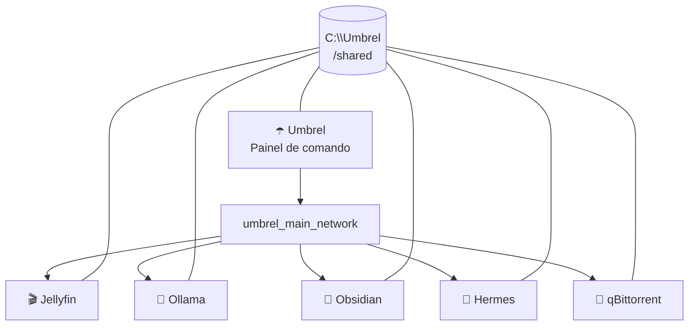

# ☂️ Umbrel Dockyard


> **Uma pequena estação espacial para os seus containers.**
> O Umbrel controla a base; Docker mantém os propulsores ligados; seus apps ficam em órbita e compartilham o mesmo hangar de arquivos.

## O que está voando aqui?

| Serviço | Porta | Função |
| --- | ---: | --- |
| Umbrel | `8080` | Painel de comando da estação |
| Jellyfin | `8096` | Missões de streaming e biblioteca de mídia |
| Obsidian | `3435` | Cofre de notas e ideias |
| Ollama | `11434` | Motor local de IA |
| Hermes Agent | `18790` | Console do agente |
| qBittorrent | `8094` | Gerenciador de torrents e downloads categorizados |

Todos os containers participam da rede `umbrel_main_network` e montam `C:\Umbrel` em `/shared`. Em outras palavras: eles se encontram pelo DNS interno do Docker e têm acesso ao mesmo hangar de arquivos.



## Lançamento rápido

Pré-requisitos: Docker Desktop em execução e PowerShell.

```powershell
# Crie a rede somente na primeira vez.
docker network create --driver bridge --subnet 10.21.0.0/16 --gateway 10.21.0.1 umbrel_main_network

# Inicie a estação.
docker compose up -d
```

Se a rede já existir, o Docker avisará — pode ignorar esse aviso e rodar apenas o segundo comando.

## Rotina de comandante

```powershell
# Verificar quem está acordado
docker compose ps

# Acompanhar o diário de bordo
docker compose logs -f

# Reiniciar só o Umbrel
docker compose restart umbrel

# Desligar a estação sem apagar dados
docker compose down
```

Os dados vivem em `C:\Umbrel`, fora do repositório. Isso é intencional: o Git guarda a planta da estação, não a carga preciosa.

## Arquivos importantes

```text
.
├── docker-compose.yml             # Casco externo do Umbrel
├── umbrel-core/
│   └── docker-compose.yml         # Auth + Tor com acesso a /shared
├── apps/
│   ├── jellyfin/                  # Snapshot do Compose do Jellyfin
│   ├── ollama/                    # Snapshot do Compose do Ollama
│   ├── obsidian/                  # Snapshot do Compose do Obsidian
│   ├── hermes-agent/              # Snapshot do Compose do Hermes
│   └── qbittorrent/               # Snapshot do Compose do qBittorrent
└── assets/
    └── umbrel-dockyard-logo.png   # Emblema da estação
```

## ⚠️ Área restrita

`/shared` é propositalmente poderoso: qualquer app conectado consegue ler e escrever em `C:\Umbrel`. É ótimo para automações e troca de arquivos; trate todos os apps instalados como partes confiáveis da mesma tripulação.

---

Construído para quem prefere hospedar a própria galáxia. ✨

## Bootstrap dos MCPs do Blink

O repositório também contém um entrypoint único para instalar e registrar no Hermes os servidores `cua-driver-windows`, `torrentclaw` e `qbittorrent`. O bridge seguro do qBittorrent e a skill de operação do Blink são copiados de `hermes/` para o volume persistente do agente.

```powershell
Copy-Item .env.example .env
# Edite .env somente com os valores desta máquina.
powershell.exe -NoProfile -ExecutionPolicy Bypass -File ./scripts/setup-hermes-mcps.ps1
```

O script é idempotente: atualiza os assets, recria os registros MCP, reinicia o Hermes pelo Umbrel e testa os três servidores. Use `-SkipRestart` ou `-SkipTests` quando precisar executar apenas parte da rotina.

O `.env` nunca é versionado. Apenas `.env.example`, sem credenciais nem caminhos pessoais, faz parte do Git. Se `QBITTORRENT_PASSWORD` ficar vazio, o script preserva o segredo já instalado no volume do Hermes; em uma instalação nova, preencha-o localmente apenas durante o bootstrap e remova o valor do arquivo depois.
