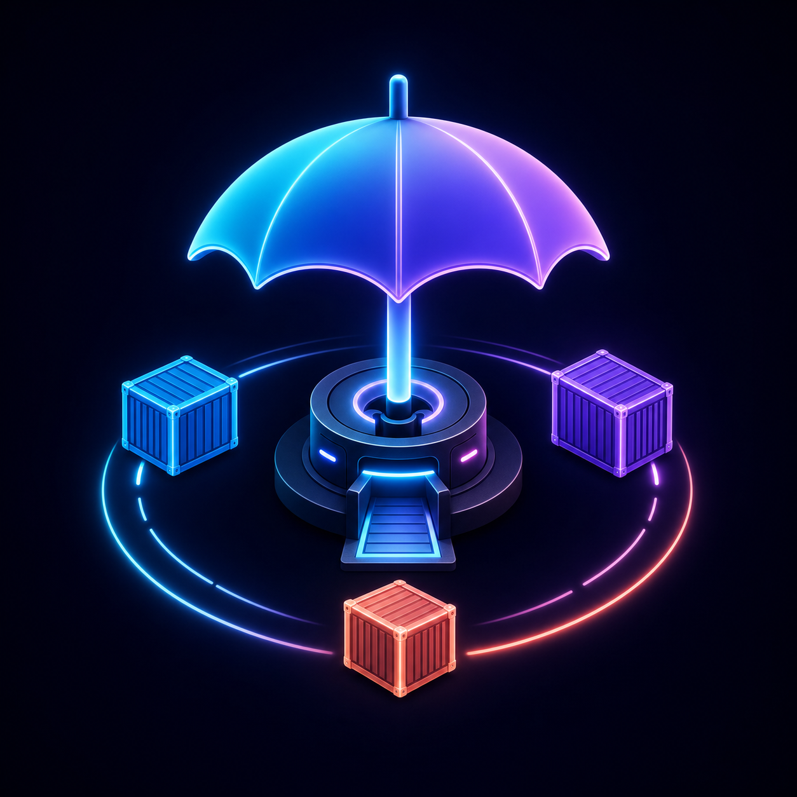
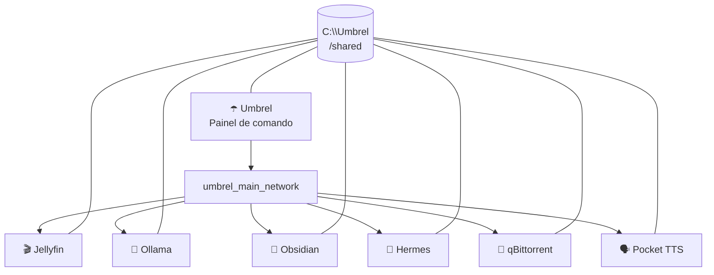

# ☂️ Umbrel Dockyard



> **Uma pequena estação espacial para os seus containers.**
> O Umbrel controla a base; Docker mantém os propulsores ligados; seus apps ficam em órbita e compartilham o mesmo hangar de arquivos.

## O que está voando aqui?

| Serviço | Porta | Função |
| --- | ---: | --- |
| Umbrel | `8080` | Painel de comando da estação |
| Jellyfin | `8096` | Missões de streaming e biblioteca de mídia |
| Obsidian | `3435` | Cofre de notas e ideias |
| Ollama | `11434` | Motor local de IA |
| Hermes Agent | `18790` | Console do agente |
| qBittorrent | `8094` | Gerenciador de torrents e downloads categorizados |
| Pocket TTS | `8000` | Síntese de voz local em português, executada em CPU |

Todos os containers participam da rede `umbrel_main_network` e montam `C:\Umbrel` em `/shared`. Em outras palavras: eles se encontram pelo DNS interno do Docker e têm acesso ao mesmo hangar de arquivos.



## Lançamento rápido

Pré-requisitos: Docker Desktop em execução e PowerShell.

```powershell
# Baixe o Pocket TTS fixado no commit usado por este projeto.
git submodule update --init --recursive

# Crie a rede somente na primeira vez.
docker network create --driver bridge --subnet 10.21.0.0/16 --gateway 10.21.0.1 umbrel_main_network

# Inicie a estação.
docker compose up -d
```

Se a rede já existir, o Docker avisará — pode ignorar esse aviso e rodar apenas o segundo comando.

## Rotina de comandante

```powershell
# Verificar quem está acordado
docker compose ps

# Acompanhar o diário de bordo
docker compose logs -f

# Reiniciar só o Umbrel
docker compose restart umbrel

# Desligar a estação sem apagar dados
docker compose down
```

Os dados vivem em `C:\Umbrel`, fora do repositório. Isso é intencional: o Git guarda a planta da estação, não a carga preciosa.

O Pocket TTS fica disponível na rede local em `http://IP-DO-SERVIDOR:8000` e, para os demais containers, em `http://pocket-tts:8000`. Os modelos e vozes baixados permanecem em `C:\Umbrel\app-data\pocket-tts`, enquanto `/shared` dá acesso ao mesmo volume dos outros serviços.

```powershell
# Gerar um WAV com a voz portuguesa padrão (Rafael)
curl.exe -X POST -F "text=Olá, mundo." http://localhost:8000/tts -o fala.wav
```

Para clonagem de voz, aceite os termos do modelo Pocket TTS no Hugging Face e defina `POCKET_TTS_HF_TOKEN` apenas no `.env` local. O token não é versionado.

## Acesso pela rede local

Os serviços são publicados pelo Docker para a máquina anfitriã. A partir de outro aparelho na mesma rede, use o IP LAN do computador e a porta do serviço — por exemplo, Jellyfin em `http://IP-DO-SERVIDOR:8096` (não `8086`).

| Serviço | Endereço na rede local |
| --- | --- |
| Umbrel | `http://IP-DO-SERVIDOR:8080` |
| Jellyfin | `http://IP-DO-SERVIDOR:8096` |
| qBittorrent | `http://IP-DO-SERVIDOR:8094` |
| Obsidian | `http://IP-DO-SERVIDOR:3435` |
| Ollama | `http://IP-DO-SERVIDOR:11434` |
| Hermes | `http://IP-DO-SERVIDOR:18790` |
| Pocket TTS | `http://IP-DO-SERVIDOR:8000` |

No Windows, abra um PowerShell **como Administrador** e execute uma vez:

```powershell
powershell -NoProfile -ExecutionPolicy Bypass -File .\scripts\configure-umbrel-lan-firewall.ps1
```

O script usa `UMBREL_LAN_SUBNET` do `.env` (aceita uma ou mais sub-redes, separadas por vírgula), cria regras de entrada restritas a elas e habilita também a descoberta do Jellyfin. Se ainda não houver acesso no celular ou TV, confirme que ambos estão na mesma sub-rede e que o roteador não está com isolamento de clientes/AP isolation ativado.

## Arquivos importantes

```text
.
├── docker-compose.yml             # Casco externo do Umbrel
├── umbrel-core/
│   └── docker-compose.yml         # Auth + Tor com acesso a /shared
├── docker/
│   └── pocket-tts/                 # Imagem CPU reproduzível do Pocket TTS
├── vendor/
│   └── pocket-tts/                 # Submódulo upstream fixado na v2.1.0
├── apps/
│   ├── jellyfin/                  # Snapshot do Compose do Jellyfin
│   ├── ollama/                    # Snapshot do Compose do Ollama
│   ├── obsidian/                  # Snapshot do Compose do Obsidian
│   ├── hermes-agent/              # Snapshot do Compose do Hermes
│   └── qbittorrent/               # Snapshot do Compose do qBittorrent
└── assets/
    └── umbrel-dockyard-logo.png   # Emblema da estação
```

## ⚠️ Área restrita

`/shared` é propositalmente poderoso: qualquer app conectado consegue ler e escrever em `C:\Umbrel`. É ótimo para automações e troca de arquivos; trate todos os apps instalados como partes confiáveis da mesma tripulação.

---

Construído para quem prefere hospedar a própria galáxia. ✨

## Bootstrap dos MCPs do Blink

O repositório também contém um entrypoint único para instalar e registrar no Hermes os servidores `cua-driver-windows`, `torrentclaw` e `qbittorrent`. O bridge seguro do qBittorrent e a skill de operação do Blink são copiados de `hermes/` para o volume persistente do agente. O mesmo bootstrap configura a cadeia de modelos `GPT 5.6 Luna → NVIDIA GPT-OSS 120B → Ollama local`.

```powershell
Copy-Item .env.example .env
# Edite .env somente com os valores desta máquina.
powershell.exe -NoProfile -ExecutionPolicy Bypass -File ./scripts/setup-hermes-mcps.ps1
```

O script é idempotente: atualiza os assets, recria os registros MCP, configura os modelos, reinicia o Hermes pelo Umbrel e testa os três servidores. Use `-SkipRestart` ou `-SkipTests` quando precisar executar apenas parte da rotina.

O fallback do Hermes é por turno. Em rate limit, sobrecarga ou falha de conexão, ele percorre NVIDIA e Ollama na ordem. No início do próximo turno, após o cooldown nativo de 60 segundos, tenta novamente o modelo principal; isso recupera o GPT antes do limite de uma hora sem criar chamadas artificiais que gastariam tokens.

O Ollama usa `OLLAMA_CONTEXT_LENGTH=32768`. O prompt e os schemas atuais ocupam cerca de 12k tokens no Qwen, então 32k mantém folga sem a reserva de aproximadamente 12 GB observada com uma janela de 64k. Como este host executa o modelo principalmente em CPU, o timeout do fallback local é configurado separadamente em `HERMES_OLLAMA_TIMEOUT`.

O `.env` nunca é versionado. Apenas `.env.example`, sem credenciais nem caminhos pessoais, faz parte do Git. Se `QBITTORRENT_PASSWORD` ficar vazio, o script preserva o segredo já instalado no volume do Hermes; em uma instalação nova, preencha-o localmente apenas durante o bootstrap e remova o valor do arquivo depois.
